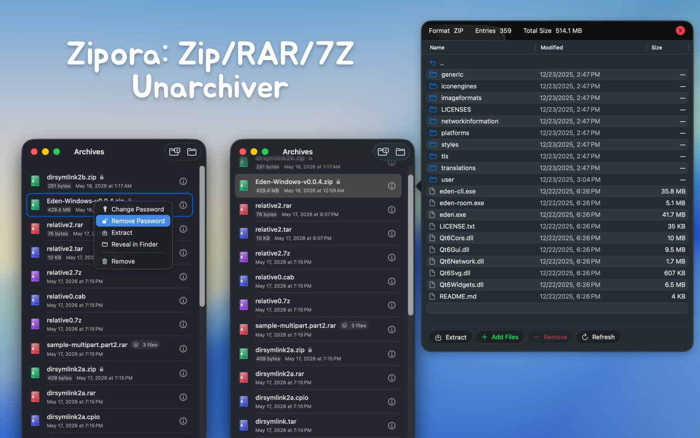
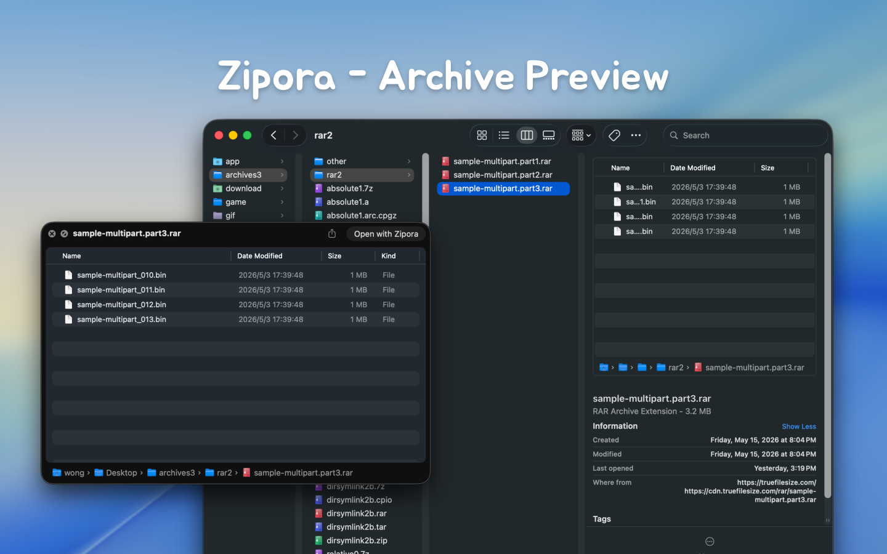
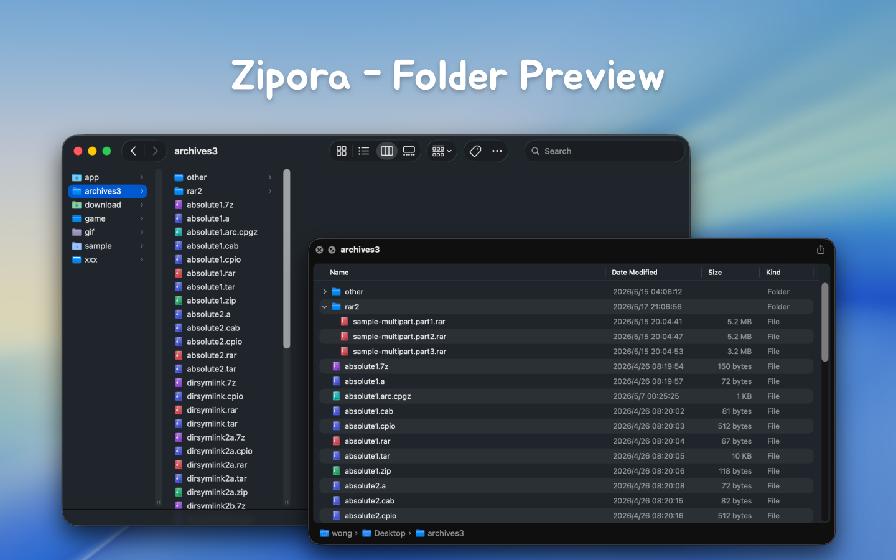

<!--idoc:ignore:start-->
> [!TIP]
> Declaration: This project is not an open-source project. The repository serves as the official website, used to collect issues and user demands. This is done to save costs, because without an official website, the application cannot pass the review.
<!--idoc:ignore:end-->

   
   
  
  <h1>
    Zipora
  </h1>
  <!--rehype:style=border: 0;-->
  

    
    
    
  

  

    <a href="./README.zh.md">简体中文</a> • 
    <a target="_blank" href="https://github.com/jaywcjlove/zipora/issues/new?template=bug_report.yml">Contact & Support</a> • 
    <a href="./CHANGELOG.md">Changelog</a>
  

  

    
  

## What Is Zipora

Zipora is a native macOS archive tool built with Swift / SwiftUI, designed for everyday desktop compression, extraction, preview, and archive organization.

It is not just an unzip utility. Zipora provides a complete archive workflow:

- Drag and drop files or folders to quickly create a new archive
- Open archives and preview tree structure, file sizes, and modified timestamps directly
- Extract to a selected directory and quickly locate results in Finder
- Keep a recent archive history for reopening, extracting, or continuing work
- Enter passwords during open or extract when a protected archive requires it
- Organize rebuildable archives by adding or removing files
- Add password protection to existing ZIP archives

## Features

- Native macOS app built with Swift / SwiftUI
- Supports macOS 14 and later
- Home screen supports drag-and-drop for archive preview/extract, or dropping multiple files/folders to create archives
- Supports recent items, availability status, and encryption status recognition
- Supports archive content preview with current-folder search and hierarchical browsing
- Supports selecting extraction destination with progress display
- Supports entering passwords to continue opening or extracting protected archives
- Supports creating ZIP, 7Z, TAR, TAR.GZ, TAR.BZ2, and TAR.XZ
- Supports creating encrypted ZIP archives
- Supports archive editing for rebuildable formats: add files and remove files
- Supports adding password protection to existing ZIP archives

## Architecture and Compatibility Strategy

Zipora currently combines two archive backends and routes by format and operation:

- `ArchiveKit`: primary path for most common formats (read, write, extract, rebuild)
- `SevenZip.swift`: preferred path for `7z` reading and extraction

When one backend is not suitable for a file, Zipora falls back to the other available path when possible to improve compatibility.

## Supported Formats

### Create Archives

The current UI can directly create the following formats:

- `zip`
- `7z`
- `tar`
- `tar.gz` / `tgz`
- `tar.bz2` / `tbz2` / `tbz`
- `tar.xz` / `txz`

Notes:

- UI format labels are `ZIP`, `7Z`, `TAR`, `TAR.GZ`, `TAR.BZ2`, and `TAR.XZ`
- `tgz`, `tbz2`, `tbz`, and `txz` are common alias extensions
- Only `ZIP` currently supports enabling password protection during archive creation

### Open / Preview / Extract

Zipora currently supports opening, previewing, or extracting the following common formats:

- `7z`
- `zip`
- `tar`
- `tgz`
- `gz`
- `bz2`
- `xz`
- `lzma`
- `zst`
- `lz4`
- `lzip`
- `cpio`
- `xar`
- `warc`
- `rar`
- `ar`
- `a`
- `deb`
- `pkg`
- `iso`
- `cab`
- `jar`
- `apk`
- `ipa`
- `whl`
- `mtree`
- `shar`

Actual support still depends on backend capabilities, plus archive structure, encryption method, and compatibility.

## Current Implementation Notes

- Whether some encrypted archives can be read, previewed, or extracted still depends on underlying archive library support
- Password entry is currently supported during open / preview / extract flows for protected archives
- Creating encrypted ZIP archives is currently supported, and password protection can also be added to existing ZIP archives
- Archive editing is implemented as: extract to temporary workspace -> modify content -> rebuild and replace the original archive, rather than direct in-place archive structure editing
- Add / remove file actions are available only for formats that the app can currently rebuild
- By default, extraction creates a folder named after the archive file in your selected destination, then extracts contents into it
