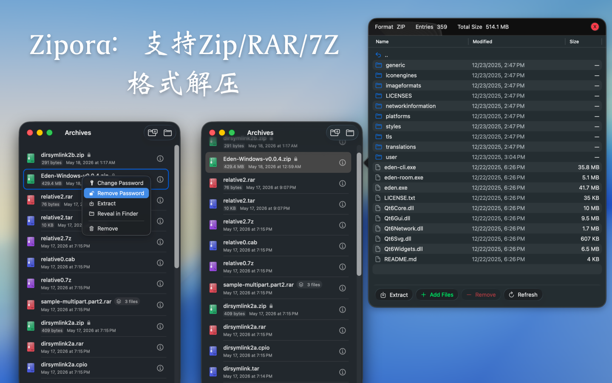
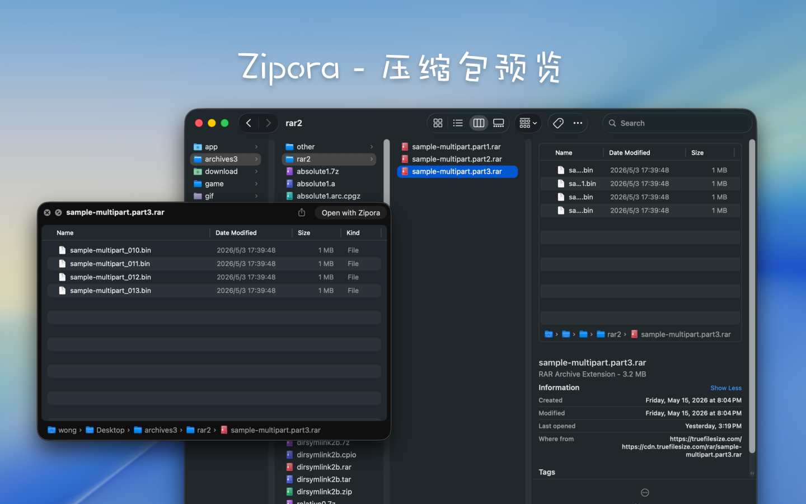
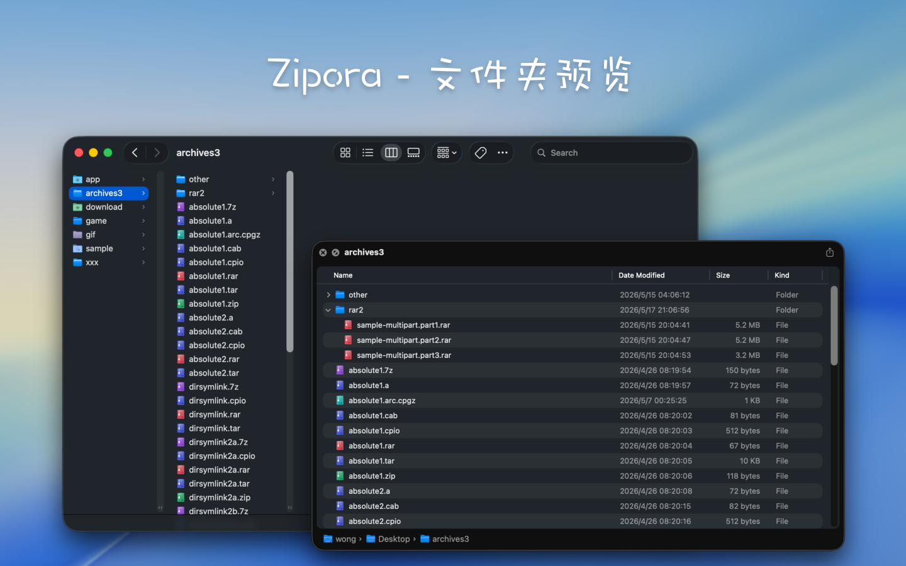

<!--idoc:ignore:start-->
> [!TIP]
> 声明：此项目并非开源项目，仓库作为官方网站，用于收集问题和用户需求。这样做是为了节省成本，因为没有官网，应用无法通过审核。
<!--idoc:ignore:end-->

   
   
  
  <h1>
    Zipora
  </h1>
  <!--rehype:style=border: 0;-->
  

    
    
    
  

  

    <a href="./README.md">English</a> • 
    <a target="_blank" href="https://github.com/jaywcjlove/zipora/issues/new?template=bug_report_cn.yml">联系&支持</a> • 
    <a href="./CHANGELOG.zh.md">更新日志</a>
  

  

    
  

## Zipora 是什么

Zipora 是一款使用 Swift / SwiftUI 构建的 macOS 原生归档工具，面向桌面上的日常压缩、解压、预览与整理场景。

它并不只是“解压器”，而是围绕归档文件提供一套完整工作流：

- 拖拽文件或文件夹，快速创建新压缩包
- 打开归档后直接预览目录树、文件大小、修改时间
- 解压到指定目录，并可在完成后从 Finder 快速定位
- 记录最近打开的归档，方便再次查看、解压或继续处理
- 遇到受密码保护的归档时，在打开或解压流程中补充密码继续操作
- 对支持重建的格式执行归档内容整理，例如添加文件、移除文件
- 为现有 ZIP 归档追加密码保护

## 功能特性

- 使用 Swift / SwiftUI 构建的 macOS 原生应用
- 支持 macOS 14 及以上版本
- 首页支持拖拽归档预览 / 解压，或拖拽多个文件和文件夹直接建包
- 支持最近打开记录，以及可用性和加密状态识别
- 支持压缩包内容预览，可按当前目录搜索并按层级浏览
- 支持选择目标目录解压，并展示进度
- 支持为受密码保护的归档输入密码后继续打开或解压
- 支持创建 ZIP、7Z、TAR、TAR.GZ、TAR.BZ2、TAR.XZ
- 支持为 ZIP 创建加密压缩包
- 支持对可重建格式执行归档编辑：添加文件、移除文件
- 支持为现有 ZIP 归档追加密码保护

## 支持的格式

### 支持创建压缩包

当前界面中可直接创建以下格式：

- `zip`
- `7z`
- `tar`
- `tar.gz` / `tgz`
- `tar.bz2` / `tbz2` / `tbz`
- `tar.xz` / `txz`

说明：

- 界面主展示格式名为 `ZIP`、`7Z`、`TAR`、`TAR.GZ`、`TAR.BZ2`、`TAR.XZ`
- `tgz`、`tbz2`、`tbz`、`txz` 是对应格式的常见别名扩展名
- 当前只有 `ZIP` 支持创建时直接启用密码保护

### 支持打开 / 预览 / 解压

当前支持打开、预览或解压以下常见格式：

`7z` / `zip` / `tar` / `tgz` / `gz` / `bz2` / `xz` / `lzma` / `zst` / `lz4` / `lzip` / `cpio` / `xar` / `warc` / `rar` / `ar` / `a` / `deb` / `pkg` / `iso` / `cab` / `jar` / `apk` / `ipa` / `whl` / `mtree` / `shar`

具体支持效果仍取决于底层后端能力，以及压缩包本身的结构、加密方式和兼容性。

## 当前实现说明

- 某些加密归档是否可读取、预览或解压，仍受底层归档库支持范围限制
- 当前支持在“打开 / 预览 / 解压”阶段为需要密码的归档输入密码
- 当前支持创建加密 ZIP，也支持为现有 ZIP 追加密码保护
- 归档编辑能力通过“解压到临时工作区 -> 修改内容 -> 重新打包替换原文件”实现，而不是直接原地修改归档结构
- 只有当前应用能够重新创建的格式，才会开放添加 / 移除文件这类编辑入口
- 默认会在你选择的目标目录下，以压缩包文件名创建同名文件夹，再把内容解压进去

<!--idoc:config:
title: Zipora
keywords: macOS压缩工具,macOS解压工具,Zipora,zip压缩,7z压缩,rar解压,归档管理器,ArchiveKit,SevenZip,加密ZIP
description: Zipora 是一款使用 Swift / SwiftUI 开发的 macOS 原生压缩与解压工具，支持创建 ZIP/7Z/TAR 系列压缩包、预览归档内容、指定目录解压、处理密码保护归档，并提供归档编辑能力。 
-->
